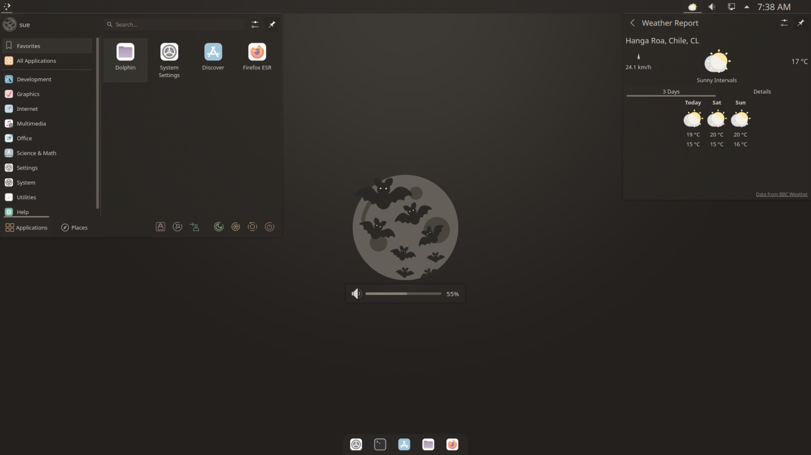
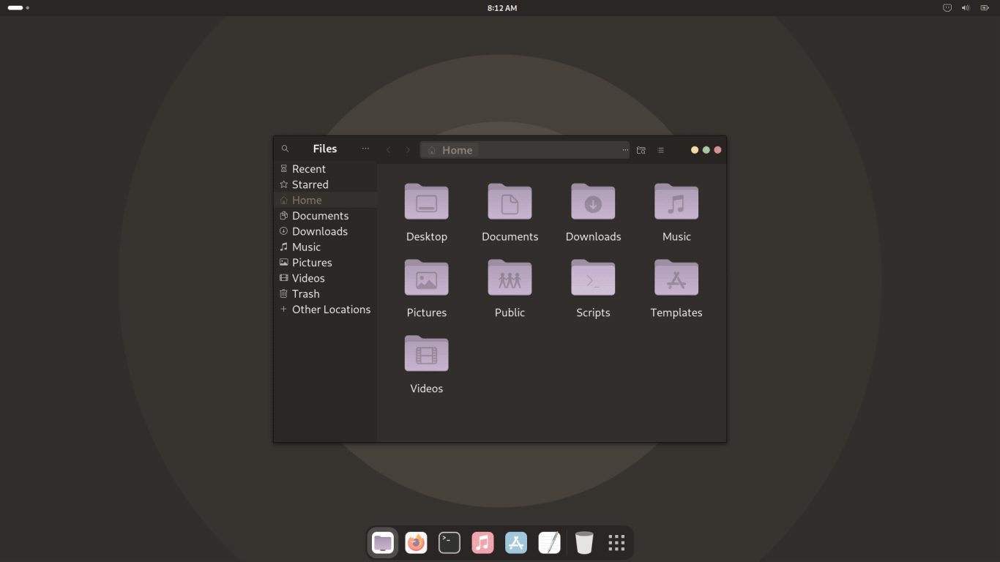

# Chocula-Pastel Desktop Theme 
A dark brown theme with pastel accents for [KDE](https://www.KDE.org/) and [GTK](https://www.gtk.org/) desktop environments, originally based on [Eliver Lara's](https://github.com/EliverLara) beautiful [Dracula theme](https://github.com/dracula/gtk)

<br/>

## Installation
Download and extract the [zip file](https://github.com/SueDonham/chocula-desktop-theme-pastel/archive/refs/heads/main.zip) or run `git clone https://github.com/SueDonham/chocula-desktop-theme-pastel.git` in a terminal.

### KDE
#### Manual
- Copy the KDE theme components into their respective directories in `~/.local/share/` or `/usr/share/`
- For consistent application theming, copy `GTK/Chocula-Pastel` into `~/.themes` or `/usr/share/themes`, as well.

#### Scripted
Open a terminal in the cloned or extracted directory and run: `cd KDE && ./install.sh`
- [install.sh](KDE/install.sh) copies the theme components (including the GTK theme) to where Plasma can find them.
- [remove.sh](KDE/remove.sh) deletes them from those locations.

Apply via System Settings > Appearance > Global Theme.


### GTK
- Copy `GTK/Chocula-Pastel` into `~/.themes` or `/usr/share/themes`, creating them if needed, or open a terminal in the cloned or extracted directory and run:
```
- mkdir -p ~/.themes && cp -r GTK/Chocula-Pastel ~/.themes
```
- Apply via your distro's settings menu, [gnome-tweaks](https://github.com/GNOME/gnome-tweaks) or similar, or by opening a terminal and running:
    ```
      gsettings set org.gnome.desktop.interface gtk-theme Chocula-Pastel
      gsettings set org.gnome.desktop.wm.preferences theme Chocula-Pastel
   ```

#### GTK systems running the newest version of Gnome using libadwaita:
- Copy `GTK/Chocula-Pastel` into a "themes" directory as described above.
- Manual way to help Gnome find the theme:
  - Copy `Chocula-Pastel/assets` into `~/.config` (`cp -r GTK/Chocula-Pastel/assets ~/.config`)
  - Copy `gtk-4.0/gtk.css` and `gtk-4.0/gtk-dark.css` into `~/.config/gtk-4.0` (`cp GTK/Chocula-Pastel/gtk-4.0/gtk*.css ~/.config/gtk-4.0`)
- Scripted way:
  - [This script](https://github.com/odziom91/libadwaita-theme-changer) creates links between the above files/directories and their new homes in ./config.


## License
[GPLv3](./LICENSE)
